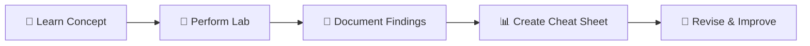

<!-- HERO SECTION -->

<h1 align="center">🛡️Learning & Documentation Hub</h1>

<p align="center">
  <b>Documenting Practical Learning • Labs • Cheat Sheets • Analyst Notes</b><br>
  A structured knowledge base built through hands-on cybersecurity practice.
</p>

<p align="center">
  <a href="#overview"></a>
  <a href="#contents"></a>
  <a href="#workflow"></a>
</p>

---

<!-- BANNER -->

<p align="center">
  
</p>

---

<!-- NAVIGATION BAR -->

<p align="center">
  <a href="#overview">Overview</a> •
  <a href="#contents">Contents</a> •
  <a href="#workflow">Workflow</a> •
  <a href="#structure">Structure</a> •
  <a href="#tools">Tools</a> •
  <a href="#usage">Usage</a>
</p>

---

## 🧭 <a name="overview"></a> Overview

> 📌 A **centralized documentation space** for structured cybersecurity learning.

This repository focuses on organizing and maintaining:

* 📚 Learning notes
* 🧪 Hands-on lab walkthroughs
* 📊 Cheat sheets & quick references
* 🧠 Key concepts and insights

<p align="center">
  <b>🎯 Goal:</b> Build a reusable, structured knowledge base
</p>

---

## ⚡ <a name="contents"></a> What You'll Find Here

<details open>
<summary><b>📦 Expand Section</b></summary>

<br>

<table>
<tr>
<td>📚 <b>Learning Notes</b></td>
<td>Concept explanations and simplified breakdowns</td>
</tr>
<tr>
<td>🧪 <b>Lab Documentation</b></td>
<td>Step-by-step walkthroughs of practical labs</td>
</tr>
<tr>
<td>📊 <b>Cheat Sheets</b></td>
<td>Quick reference for commands, queries, and tools</td>
</tr>
<tr>
<td>🧠 <b>Insights</b></td>
<td>Key takeaways and patterns observed during practice</td>
</tr>
</table>

</details>

---

## 🔍 <a name="workflow"></a> Learning Workflow



<p align="center">
  <i>Structured learning → Better retention → Faster revision</i>
</p>

---

## 📂 <a name="structure"></a> Repository Structure

```bash
📦 Overview-And-Documentation
 ┣ 📂 Topic-1
 ┣ 📂 Topic-2
 ┣ 📂 Topic-3
 ┣ 📂 Topic-n
 ┗ README.md
```

---

## 🧰 <a name="tools"></a> Tools & Technologies

<p align="center">


</p>

---

## 🧠 <a name="usage"></a> How to Use This Repository

<details>
<summary><b>📌 Click to Expand Usage Guide</b></summary>

<br>

* 📌 Start with **Notes** for concepts
* 🧪 Follow **Labs** for hands-on practice
* ⚡ Use **Cheat Sheets** for quick revision
* 🔁 Revisit regularly to reinforce learning

</details>

---

## 📈 Continuous Improvement

* [ ] Add more lab walkthroughs
* [ ] Expand cheat sheets
* [ ] Improve documentation clarity
* [ ] Organize topics for faster navigation

---

## ⚠️ Disclaimer

> This repository contains **educational labs and personal learning only**.
> It is intended purely for **documentation and practice purposes**.

---

## ⭐ Final Thought

<p align="center">
  <b>"Consistency in learning + documentation = long-term mastery."</b>
</p>

---
